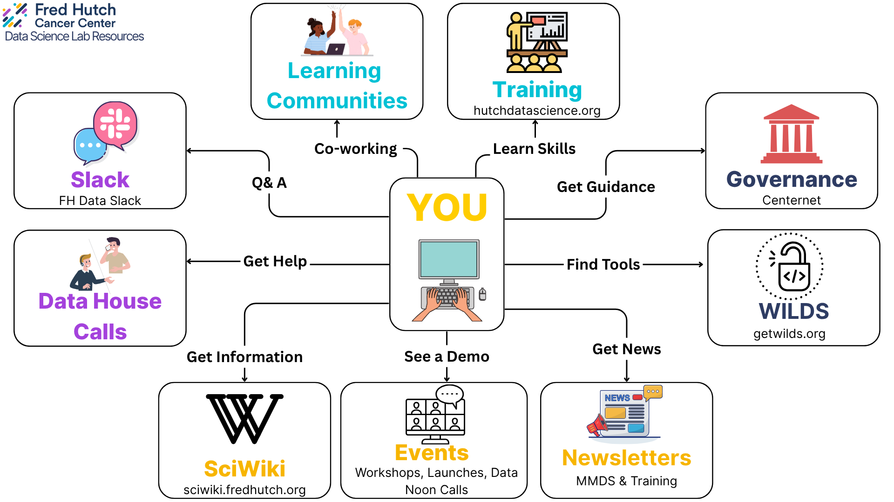

# FHIL Data Science knowledgebase

This is a record of standard operating procedures (SOPs), resources, and general knowledge for data science at the Innovation Lab at Fred Hutch (FHIL).
This repo should be living documentation that is updated with new information as we discover them, but should preserve concepts for posterity and include rationale for changing them. 
Whenever possible, we should include links to papers, repos, vignettes, etc. that support a practice, and we should attempt to summarize the methods and justifications of a particular step.
If we explore a procedure that we decide not to implement, it is worth including it too to avoid revisiting dead topics and save others from wasting time.
The pages are hosted at this GitHub repo and can be edited at any time to modify this site. 
It can take up to 10 minutes for changes to your site to publish after you push the changes to GitHub. 

There is already a wealth of knowledge available online and through FH resources.
This site is meant to be a central hub pointing you to other resources, outlining FHIL specific workflows, and bridging the gaps where necessary. 

## Onboarding

- Join the [github team for FHIL](https://github.com/Fred-Hutch-Innovation-Lab)
    - This will give you access to template repos and code developed for FHIL workflows
- [Get access to the HPC at FH]()
- Familiarize yourself with the [FHIL database]()
- Explore the [main directories]() to get a feel for how things are stored
- Review the [data science workflow]() for a general guide to day-to-day operations

## Other resources

- [Centernet](https://centernet.fredhutch.org/) Many resources and annoncements for the institution. See courses, events/talks on the calendar, HR resources, etc. 
- [FH Sciwiki](https://sciwiki.fredhutch.org/) has much more thorough discussions of many topics included here. This should be your first stop for questions.
- Use [Workday](https://wd5.myworkday.com/wday/authgwy/fhscca/login.htmld?returnTo=%2ffhscca%2fd%2fhome.htmld) to enter PTO requests. Use the Fred-hutch login
- [FH DataScience slack](https://join.slack.com/t/fhdata/signup) the link may expire over time, see the footer of the Sciwiki for an active link (hopefully).
- [Data Science Lab (DaSL)](https://hutchdatascience.org) Workshops, courses, house calls, and lots of other resources for community-oriented data science at FH. 
    - [Weekly newsletter](https://fhdata.substack.com/) Not always active, but can have cool resources
- [Openscapes](https://ocdo.fredhutch.org/programs/openscapes.html) An open-science intitiative with short cohorts of FH people. A great place to connect with other computational people at FH and learn about best practices in computational research. 
- [WILDS](https://getwilds.org/) Open source software developed at FH. 

## Site Information

This site is built with [Jekyll] using the [Just the Docs] theme and is hosted for free on [GitHub Pages] and updated by the [GitHub Pages / Actions workflow]. 

----

[Just the Docs]: https://just-the-docs.github.io/just-the-docs/
[GitHub Pages]: https://docs.github.com/en/pages
[README]: https://github.com/just-the-docs/just-the-docs-template/blob/main/README.md
[Jekyll]: https://jekyllrb.com
[GitHub Pages / Actions workflow]: https://github.blog/changelog/2022-07-27-github-pages-custom-github-actions-workflows-beta/
